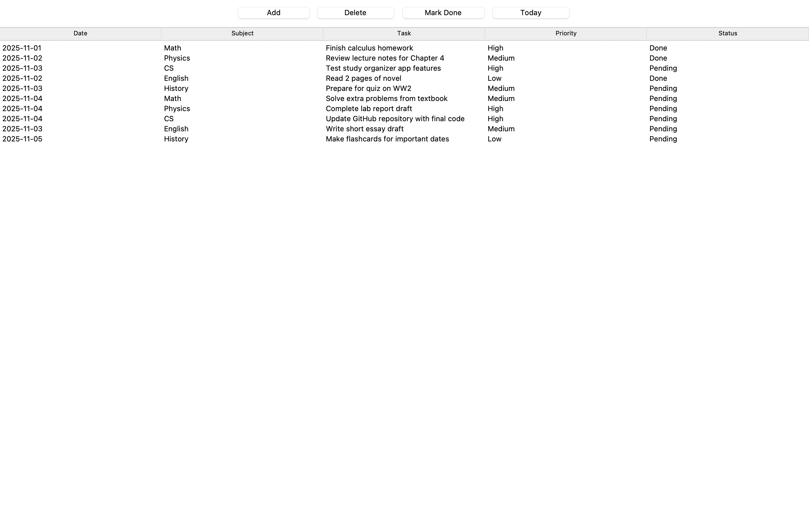

# Study Organizer

A simple Python Tkinter app to manage your daily study tasks.

## Features
- Add tasks with subject, description, deadline, and priority
- Delete tasks
- Mark tasks as done
- View today's pending tasks
- Tasks are saved persistently in a text file

## Screenshots


## How It Works
- Tasks are stored in `study_data.txt` as `subject | task | date | priority | status`.
- The main GUI uses Tkinter with buttons for Add, Delete, Mark Done, and Today.
- Tasks are displayed in a Treeview table.
- Input validation ensures correct date format and priority.

## How to Run
1. Clone this repository.
2. Make sure you have Python installed.
3. Run:
   ```bash
   python study_organizer.py
